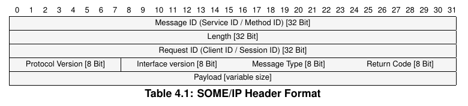

# Image
This is photo loading test:

# Math

Inline math: $\theta = 0$

Multiline math equation:

$$
i\hbar\frac{\partial}{\partial t}\psi=-\frac{\hbar^2}{2m}\nabla^2\psi+V\psi
$$

LaTeX syntax:

\begin{eqnarray\*}
\nabla\cdot\vec{E}&=&\frac{\rho}{\epsilon_0}\\\\
\nabla\cdot\vec{B}&=&0\\\\
\nabla\times\vec{E}&=&-\frac{\partial B}{\partial t}\\\\
\nabla\times\vec{B}&=&\mu_0\left(\vec{J}+\epsilon_0\frac{\partial E}{\partial t}\right)\\\\
\end{eqnarray\*}