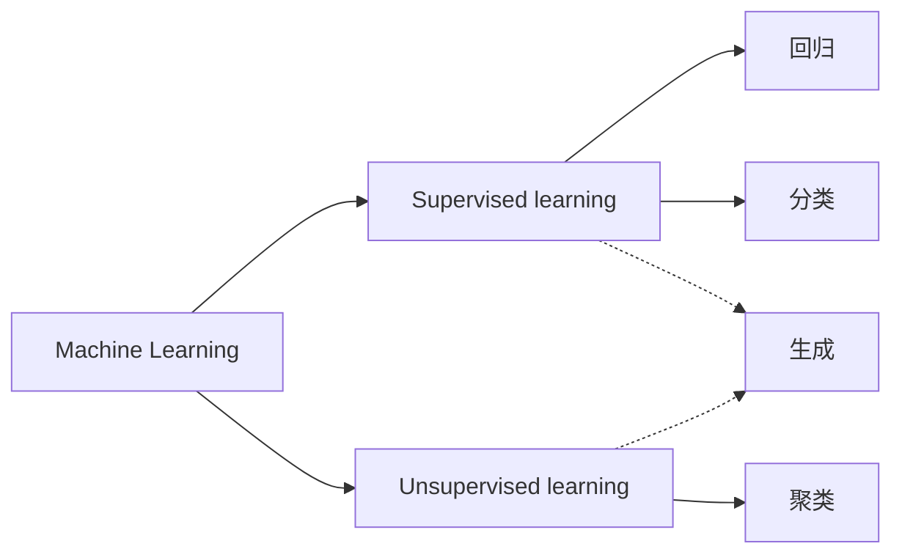

计算机能够比人类更高效地读取大量的数据、学习数据的特征并从中找出数据的模式。这样的任务也被称为**机器学习**或者**模式识别**。

机器学习擅长的任务：
- 回归 Regression
    预测连续值，如：房价、温度
- 分类 Classification
    预测离散标签，如：辣鸡邮件检测、图像分类
- 聚类 Clustering
    无监督分组

学习输入数据到输出标签的映射。

现在还多了一种：
- 生成 Generating
    学习数据分布，生成新的样本：LLM（GPT）、图像（Stable Diffusion）、音频（VALL-E）、视频（Sora）

使用有标签的数据进行的学习称为**有监督学习**，与之相反，使用没有标签的数据进行的学习称为**无监督学习**。
生成模型的训练通常以无监督或自监督为核心，但实际应用时可能引入监督信号以提升可控性。

