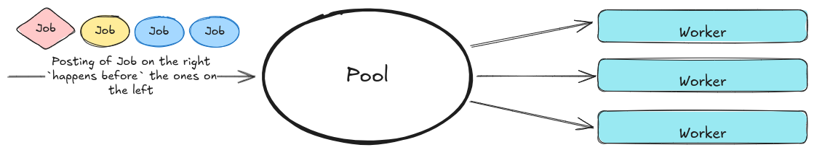
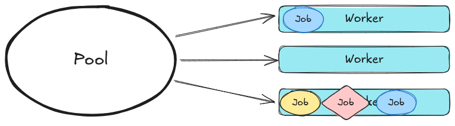
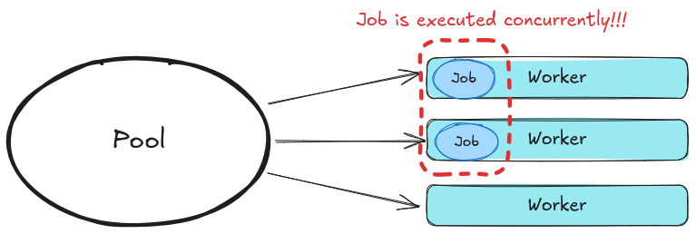
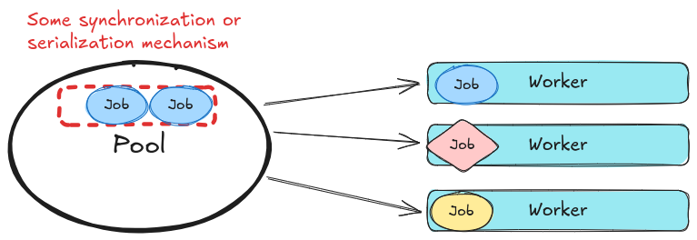

# Thread Pool

## 背景

系统里有些业务不是很重型的模块，相对独立，但是不少模块为了做异步操作、或者定时器，都起了专属于自己的线程。

当然这些线程的管理也很原始，就是一个 `queue` 加上一些线程安全、条件变量，就不赘述了。

于是打算把这些资源重新整合一下，限制系统整体的线程数，期望上是一个有正收益的事情。

很自然地就想到，直接起一个全局线程池[^1][^2]，然后把任务全丢进去就好了：

```cpp
bool PostJob(JobT job) {
  static ThreadPool pool{};
  pool.post(std::move(job));
}
```

```cpp
class App {
  void OnCallback() {
    PostJob([this] {
      //...
    });
  }
};
```

## 方案推演
### 基本定义
Job：需要线程池执行的任务单元。语言上通常体现为 `std::function` 的某种特化类型，最常见是 `std::function<void()>`。

### 对线程池的预期
先对线程池做一些基本的假设，或者陈述一下对它的预期：
1. 线程池内部大概率有多个线程来执行 job。
    > 这不是废话吗，不然为什么叫池。

    

2. 处理线程对 Job 的调度是公平的，Job 会被随机分配到任何一个线程中执行。
    > 当然会有一些可以配置优先级的线程池，不在这次讨论范围里面。

3. 各个线程的 workload 不一定是 balance 的，可能出现一线程有难，多线程围观的情况。其实这个可以看作是 2. 的延伸，也跟操作系统的调度配置和运行情况有关。

    

其中综上所述，想强调的点其实就是，**默认情况下**， Job 的执行顺序和执行所在线程是不可预知的。

### 线程池改造引入的问题

交叉分析一下当前的业务逻辑和线程池的特性，就会发现一些需要考虑的地方：

1. 线程池里的任务是乱序的，而业务信息的处理是可能是有顺序要求的。

   回看[背景](#背景)里面写的代码，写的是 `OnCallback`，说明在这里其实做了一个回调函数执行线程的转移。这种做法是很常见的，尤其是回调函数被注册到某些框架里面，我们希望尽快保留或者转移必要的信息，然后从释放框架的调度线程。

   假设报文按照 A、B 的顺序被传入回调函数，我们通过 `PostJob(ProcessA)` `PostJob(ProcessB)` 完成响应。由于线程池执行任务的**时序不可控**，所以可能会出现 `ProcessB` 先于 `ProcessA` 完成，在某些业务场景下，**输出结果顺序的变化可能导致业务逻辑的错误或者回退**！

2. 可能引入了原本不存在的数据竞争问题。

   原本不存在数据竞争是指：假设框架不会并发调用注册的回调函数，那么回调函数中访问的资源（成员对象）是安全的（假设没有另外起线程访问成员）~~怎么假设这么多啊~~。

   在没有使用线程池把操作异步化之前，回调函数都是在框架调度的线程中执行的（串行的）。

   > 框架会不会并发调用用户注册的回调函数，需要看对应的文档。反正 `vsomeip` 是会。

   使用线程池之后，回调函数中使用到的**所有资源**都要考虑并发问题，包括：

   - 成员数据：很常见的 lambda 捕获 `this` 指针用法；
   - **调用的 API**：这个不太容易察觉到。举个栗子，`std::cout` 就不是线程安全的。
   
   

当你使用线程池之后，最大的挑战其实是对本身业务设计的挑战，有状态的东西越多、上下文越多、耦合的东西越多，并行化就越困难。所以一直强调无状态 `stateless` 真的对于并发很有帮助。

### 应对方案

又想用线程池，Job 又有状态，又不想加锁，哪只能通过串行化避免数据竞争了。

串行化通常的做法是通过 id 或者 tag，识别是否有**同类的 Job** 正在被调度，如果有那么就排队。一个比较简单的实现是特定 id 的 Job 只能运行在特定的线程上，具体到实现上就看怎么抽象出 id 和执行队列了，不展开。



这个串行化只针对同类型的 Job，总的来说整个系统的并发度和资源利用率也是有提高的。

可以参考 `boost::asio::io_context::strand`[^3]。


# Json vs YAML

某同事说新整了一套配置文件管理，用来支撑平台化 blablabla…我打开一看，卧槽：

- 看不到设计：
  - 哪里平台了
  - 哪些是共享的
  - 哪些是独有的派生
  
  列个文件目录就算平台化了吗？
  
- 怎么又是YAML？服了
这会先来“喷”一下YAML，这种缩进诡异，类型约束不严谨，IDE 没提示的妖孽，要不是大多博客系统（包括现在跑的这个）都用，我可能还真一辈子用不着。

当然了起手就用 YAML 也不确定是不是他们的一种思维定势和路径依赖。

> 路径依赖（英语：path dependence）是指给定条件下人们的决策选择受制于其过去的决策经验和既成收益的影响，即使过去的境况可能已经过时并不适用于现有境况。
既然是新做的，那肯定要做好吧，那来简单分析一下，从他文档里面可以看到有这么些诉求：

1. 字段属性：必选，可选，多选，范围内N选1；

2. 有共享需求：写了一个叫做 common def 的配置，看来是想在不同的文件中复用某些定义的。
Json schema 可以完美解决这两个需求。
简单来说，Json 有这么些优势：

- 语法规范严格，不少异常在IDE里面都能飙红识别出来；

- Schema，增强了类型约束，提供编写时候的代码提示；

- 生态友好，Python、JS这些语言都原生支持，数据访问方式上都跟 Json 本身的结构一致，很符合人类直觉，对异常值处理也很方便；

- 性能好，问了下Claude，它说处理 Json 的性能大概是 YAML 的 5 倍左右，我没测，我信了。

---

好困，好想睡觉，下班。


[^1]:[ThreadPool](https://github.com/progschj/ThreadPool)
[^2]:[thread-pool](https://github.com/bshoshany/thread-pool)
[^3]:[io_context::strand](https://www.boost.org/doc/libs/latest/doc/html/boost_asio/reference/io_context__strand.html)