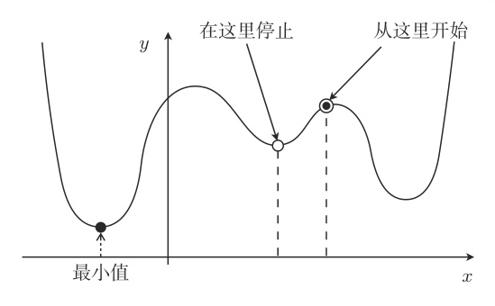

# 最小二乘法
假设有二元函数：
$$
f_{\theta}(x)=\theta_{0}+\theta_{1}x
$$

我们将训练数据中的广告费代入 $f_{\theta}(x)$  ，把得到的点击量与训练数据中的点击量相比较，然后找出使二者的差最小的 $\theta$，这种问题叫做**最优化问题**。

误差之和可以用表达式表示，称为**目标函数**：

$$
E(\bm\theta) = \frac{1}{2}\sum_{i=1}^{n}(y^{(i)}-f_{\bm\theta}(\bm x^{(i)}))^2
$$
> 1. 这里的 $x^{(i)}$ 是指第 $i$ 个训练数据，不是次幂。
> 2. 为了避免误差相互抵消，所以不能简单把误差累加；这里不用绝对值用平方，是因为后面要微分，平方的微分比绝对值简单。

# 最速下降法

微分是计算变化的快慢程度时使用的方法。

对于一个函数 $f(x)$ 来说，只要向与导数的符号相反的方向移动 $x$，$f(x)$ 就会自然而然地沿着**极小值**的方向前进了。

这也被称为**最速下降法（Steepest descent）** 或 **梯度下降（Gradient descent）** 法：
$$
x := x - \eta\frac{d}{dx}f(x)
$$

$\eta$ 是称为学习率的正常数，影响收敛速度，甚至可能导致计算结果无法收敛。

---

$f_{\theta}(x)$ 是关于 $\theta_0$，$\theta_1$ 的双变量函数，所以不能用普通的微分 $\frac{d}{dx}$，要用偏微分：
$$
\theta_0 := \theta_0 - \eta\frac{\partial E}{\partial\theta_0}
$$
$$
\theta_1 := \theta_1 - \eta\frac{\partial E}{\partial\theta_1}
$$

发现 $u(\theta)$ 不是对 $\theta$ 的直接函数，可以考虑使用**复合函数**的微分法则，假设：
$$
\begin{aligned}
u=E(\theta)
\\
v=f_\theta(x)
\end{aligned}
$$
则有：
$$
\frac{\partial u}{\partial \theta _{i}} = \frac{\partial u}{\partial v} \cdot \frac{\partial v}{\partial \theta _{i}}
$$

先求第一部分的导数：

$$
\begin{aligned}
	\frac{\partial u}{\partial v} \\
	& = \frac{\partial}{\partial v}\left({ \frac{1}{2} \sum_{i=1}^{n} \left(y^{(i)} - v\right)^2}\right)                    &  & \impliedby 代入E_{\theta} \\
	& ={ \frac{1}{2} \sum _{i=1}^{n} \left( { \frac{\partial u}{\partial v} \left(y^{(i)} - v\right)^2} \right)}            &  & \impliedby 微分分配律        \\
	& ={\frac{1}{2} \sum _{i=1}^{n} \left({\frac{\partial u}{\partial v} \left({y^{(i)}}^2 -2y^{(i)}v +v^2\right)} \right)} &  & \impliedby 展开平方         \\
	& ={\frac{1}{2} \sum _{i=1}^{n} \left(-2y^{(i)} + 2v \right) }                                                          &  & \impliedby 对v求导         \\
	& ={\sum _{i=1}^{n} \left(v - y^{(i)}\right)}                                                                           &  & \impliedby 常量提取
\end{aligned}
$$

然后是第二部分：
$$
\begin{aligned}
\frac{\partial v}{\partial\theta_{0}}=\frac{\partial}{\partial\theta_{0}}(\theta_{0}+\theta_{1}x)=1
\\
\frac{\partial v}{\partial\theta_{1}}=\frac{\partial}{\partial\theta_{1}}(\theta_{0}+\theta_{1}x)=x
\end{aligned}
$$

# 多项式回归

增加函数中多项式的次数,然后再使用函数的分析方法被称为多项式回归：
$$
f_\theta(x) = \theta_0 + \theta_1x + \theta_2x^2 + \dots + \theta_nx^n
$$
偏导数对应更新就好了：
$$
\theta_n := \theta_n - \eta\frac{\partial u}{\partial\theta_n}
$$

# 多重回归

与多项式回归**增加变量的幂次数**不同，多重回归描述的是**包含多个变量**的回归场景。
$$
f_\theta(x_1, \dots ,x_n) = \theta_0 + \theta_1 x_1 + \dots + \theta_n x_n
$$
然后使用列向量来表示：
$$
\bm{\theta}=
\begin{bmatrix}
	\theta_{0} \\
	\theta_{1} \\
	\theta_{2} \\
	\vdots     \\
	\theta_{n}
\end{bmatrix}
,\quad
\bm{x}=
\begin{bmatrix}
	x_{0}  \\
	x_{1}  \\
	x_{2}  \\
	\vdots \\
	x_{n}
\end{bmatrix}\quad(x_{0}=1)
$$
那么：
$$f_{\theta}(\bm{x})=\bm{\theta}^\top \bm{x}$$

算偏导数也是一样的，用链式法则，只需要重新算一下第二部分：
$$
\begin{aligned}
	\frac{\partial v}{\partial\theta_{j} }
	&=\frac{\partial}{\partial\theta_{j} }(\bm{\theta}^{\top} \bm{x})
	\\
	&=\frac{\partial}{\partial\theta_{j} }(\theta_{0}x_{0}+\theta_{1}x_{1}+\cdot\cdot\cdot+\theta_{n}x_{n})
	\\
	&=x_j
	\\
	\theta_{j} & := \theta_{j}-\eta\sum_{i=1}^{n}\left(f_{\theta}(\bm{x}^{(i)})-y^{(i)}\right)x_{j}^{(i)}
\end{aligned}
$$

# 随机梯度下降法

用最速下降法来找函数的最小值时，选用随机数作为初始值的情况比较多。不过这样每次初始值都会变，进而导致陷入局部最优解的问题。

而在随机梯度下降法中会随机选择 $m$ 个训练数据，并使用它来更新参数：
$$
\theta_{j}:=\theta_{j}-\eta\sum_{k\in K}\left(f_{\theta}(\bm{x}^{(k)})-y^{(k)}\right)x_{j}^{(k)}
$$

这种做法被称为 **小批量（mini-batch）** 梯度下降法。