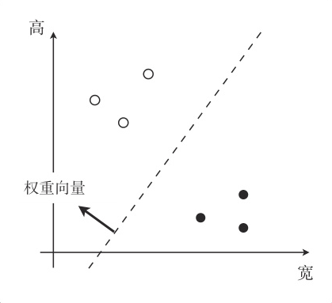
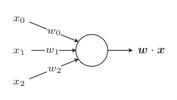
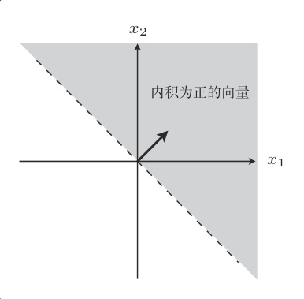
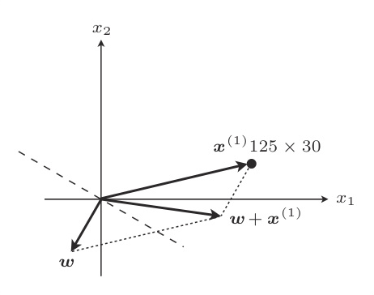
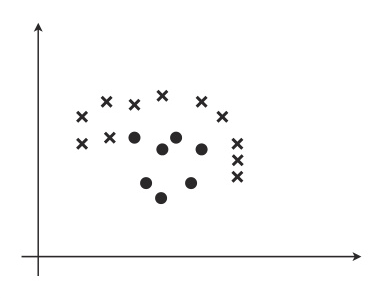
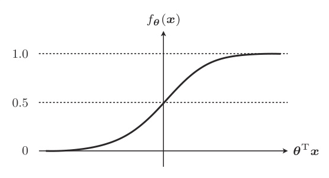
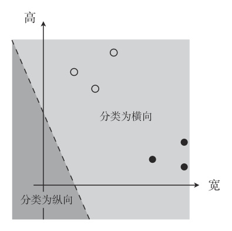

# 内积

分类需要寻找一条以**权重向量**为法向量的直线，设法向量为 $w$，那么直线的表达式可以通过**向量的内积**表示为：
> 实向量空间的内积是各相应元素乘积的和。

$$\bm{w}\cdot\bm{x} = \sum_{i=1}^{n}w_{i}x_{i}=0$$

内积的另一种写法：
$$\bm{w}\cdot\bm{x} = |\bm{w}| \cdot |\bm{x}|\cdot cos\theta$$
要使内积为0，意味着 $\theta=90^\circ$ 或者 $\theta=270^\circ$。

# 感知机

感知机是接受多个输入后将每个值与各自的权重相乘，最后输出总和的模型。

内积是衡量向量之间相似程度的指标。结果为正，说明二者相似；为 0 则二者垂直；为负则说明二者不相似。

分类的**判别函数**：
假设两个分类的标签（值）为 `1` 和 `-1`，

$$
f_{\bm{w}}(\bm{x})=
\begin{cases}
1 && (\bm{w} \cdot \bm{x} \ge 0)
\\
-1 && (\bm{w} \cdot \bm{x} \lt 0)
\end{cases}
$$

更新权重的表达式可以写为
$$
\bm{w} :=
\begin{cases}
	\bm{w}+ y^{(i)}\bm{x}^{(i)} &  & \left(f_{\bm{w}}(\bm{x}^{(i)})\ne y^{(i)}\right) \\
	\bm{w}                      &  & \left(f_{\bm{w}}(\bm{x}^{(i)}) = y^{(i)}\right)
\end{cases}
$$

> 这说明更新表达式只有在判别函数分类失败的时候才会更新参数值。

虽然有加法和减法的区别，但它们的做法都是在分类失败时更新权重向量，使得直线旋转相应的角度。像这样重复更新所有的参数，就是感知机的学习方法。

# 线性可分

感知机的缺点是它只能解决线性可分的问题，像这样不能用直线分类的就不是线性可分：

既然有单层，就会有多层，*实际上多层感知机就是神经网络了*。

# 逻辑回归

与回归的时候类似，我们也定义一个 $f_{\bm \theta}(\bm x)$：
$$
f_{\bm \theta}(\bm x) = \frac{1}{1 + \exp(-\bm\theta^\top\bm x)}
$$

这个叫做 **`sigmoid` 函数**。

几个重要的特性：
1. $\bm\theta^\top\bm x = 0$ 时，$f_{\bm \theta}(\bm x) = 0.5$
2. $0 \lt f_{\bm \theta}(\bm x) \lt 1$
    > 因为这个取值范围，所以它可以作为**概率**来使用。

把函数的输出解释为“在给出数据 $\bm{x}$ 时候，样本属于类别 `1`”的条件概率，即：
$$
f_{\bm \theta}(\bm x) = P(y=1 \mid \bm x)
$$
根据 `sigmod` 的性质，有：
$$
y=
\begin{cases}
	1 &  & ({f_{\bm \theta}(\bm x) \ge 0.5}) \\
	0 &  & ({f_{\bm \theta}(\bm x) \lt 0.5})
\end{cases}
\implies y=
\begin{cases}
	1 &  & ({\bm\theta^\top\bm x \ge 0}) \\
	0 &  & ({\bm\theta^\top\bm x \lt 0})
\end{cases}
$$

我们称直线 ${\bm\theta^\top\bm x = 0}$ 就是**决策边界**。
为了求得正确的参数 $\bm\theta$ 而定义目标函数，进行微分，然后求参数的更新表达式，这种算法就叫**逻辑回归**。

# 似然函数

假定所有的训练数据都是互不影响、独立发生的，这种情况下整体的概率就可以用下面的**联合概率**来表示：
$$
L(\bm\theta) = \prod_{i=1}^{n} P(y^{(i)}=1\mid\bm x^{(i)})^{y^{(i)}} P(y^{(i)}=0\mid\bm x^{(i)})^{1-y^{(i)}}
$$
这个函数叫做**似然函数（Likelihood）**。
> 这个表达式利用了任何数字的 0 次方都是 1 的特性，其实乘起来有一个 $P(y\mid x)$ 是 0。

现在考虑的是联合概率，我们希望概率尽可能大，所以要最大化。我们可以认为似然函数 $L(\bm\theta)$ 中，使其值最大的参数 $\theta$ 能够最近似地说明训练数据。

# 对数似然函数

直接对似然函数进行微分有点困难，在此之前要把函数变形一下，取对数就可以了：

$$
\begin{aligned}
\log L(\bm\theta) 
&= \log \prod_{i=1}^{n}
P(y^{(i)}=1\mid\bm x^{(i)})^{y^{(i)}}
P(y^{(i)}=0\mid\bm x^{(i)})^{1-y^{(i)}} 
\\
&=\sum_{i=1}^{n}
\left(
\log P(y^{(i)}=1\mid\bm x^{(i)})^{y^{(i)}} + 
\log P(y^{(i)}=0\mid\bm x^{(i)})^{1-y^{(i)}}  
\right) && \impliedby \log(ab)=\log a + \log b
\\
&=\sum_{i=1}^{n}
\left(
{y^{(i)}} \log P(y^{(i)}=1\mid\bm x^{(i)}) + 
({1-y^{(i)}}) \log P(y^{(i)}=0\mid\bm x^{(i)}) 
\right) && \impliedby \log(a^b)=b \log a
\\
&=\sum_{i=1}^{n}
\left(
{y^{(i)}} \log P(y^{(i)}=1\mid\bm x^{(i)}) + 
({1-y^{(i)}}) \log (1 - P(y^{(i)}=1\mid\bm x^{(i)})) 
\right) && \impliedby P(y^{(i)}=0\mid\bm x^{(i)}) = 1 - P(y^{(i)}=1\mid\bm x^{(i)})
\\
&=\sum_{i=1}^{n}
\left(
{y^{(i)}} \log f_{\bm\theta}(\bm x^{(i)}) + 
({1-y^{(i)}}) \log (1 - f_{\bm\theta}(\bm x^{(i)})) 
\right) && \impliedby P(y=1 \mid \bm x) = f_{\bm \theta}(\bm x)
\end{aligned}
$$

然后要对似然函数做微分：
$$
\log L(\bm\theta) =
\sum_{i=1}^{n}
\left(
{y^{(i)}} \log f_{\bm\theta}(\bm x^{(i)}) + 
({1-y^{(i)}}) \log (1 - f_{\bm\theta}(\bm x^{(i)})) 
\right)
$$

$$
\frac{\partial}{\partial\theta_j} \log L(\bm\theta) = 
\frac{\partial}{\partial\theta_j}
\sum_{i=1}^{n}
\left(
{y^{(i)}} \log f_{\bm\theta}(\bm x^{(i)}) + 
({1-y^{(i)}}) \log (1 - f_{\bm\theta}(\bm x^{(i)})) 
\right)
$$

使用复合函数：
$$
\begin{aligned}
u &= \log L(\bm\theta) \\
v &= f_{\bm\theta}(\bm x) = \frac{1}{1 + \exp(-\bm\theta^\top\bm x)}
\end{aligned}
$$

链式法则启动：
$$
\frac{\partial u}{\partial \theta_j} = 
\frac{\partial u}{\partial v} \cdot \frac{\partial v}{\partial \theta_j}
$$
第一部分：
$$
\begin{aligned}
\frac{\partial u}{\partial v}
&=\frac{\partial \log L(\bm\theta)}{\partial f_{\bm\theta}(\bm x)}
\\
&=\frac{\partial}{\partial v}
\sum_{i=1}^{n}
\left(
{y^{(i)}} \log v + 
({1-y^{(i)}}) \log (1 - v) 
\right) && \impliedby 代入 f_{\bm\theta}(\bm x) = v
\\
&=
\sum_{i=1}^{n}\left(\frac{y^{(i)}}{v} - \frac{1-y^{(i)}}{1-v} \right)
&& \impliedby \log (x) = \frac{1}{x}, \text{notice the minus sign in $-v$}
\end{aligned}
$$

第二部分：
> 插播 `sigmod` 函数的导数： $\frac{d\sigma(x)}{dx} = \sigma(x)(1-\sigma(x))$

$$
\begin{aligned}
\frac{\partial v}{\partial \theta_j} &= v(1-v) \frac{\partial}{\partial \theta_j} \bm\theta^\top \bm x && \impliedby {\bm\theta^\top \bm x} \text{看成一个元} \\
&= v(1-v) x_j
\end{aligned}
$$

结合一下：
$$
\begin{aligned}
\frac{\partial u}{\partial \theta_j}
&= 
\sum_{i=1}^{n}
\left(\frac{y^{(i)}}{v} - \frac{1-y^{(i)}}{1-v} \right)\cdot
v(1-v) x_j^{(i)}
\\
&=
\sum_{i=1}^{n}
\left(y^{(i)}-v \right)x_j^{(i)}
\\
&=
\sum_{i=1}^{n}
\left(y^{(i)}-f_{\bm\theta}(\bm x^{(i)}) \right)x_j^{(i)}
\end{aligned}
$$

因为我们需要最大化似然函数的值，所以参数要与微分结果同方向移动，所以更新参数的表达式为，：
$$
\bm\theta_j := \bm\theta_j + \eta\sum_{i=1}^{n}
\left(y^{(i)} - f_{\bm\theta}(\bm x^{(i)}) \right)x_j^{(i)}
$$
可以取个反，这样就跟回归的时候一样了：
$$
\bm\theta_j := \bm\theta_j - \eta\sum_{i=1}^{n}
\left(f_{\bm\theta}(\bm x^{(i)} - y^{(i)}) \right)x_j^{(i)}
$$