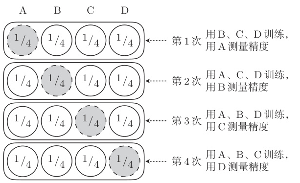
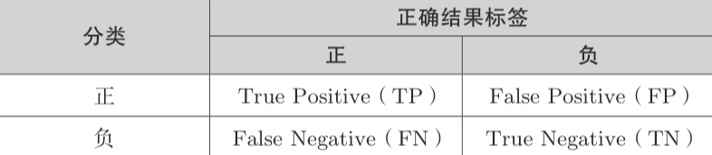
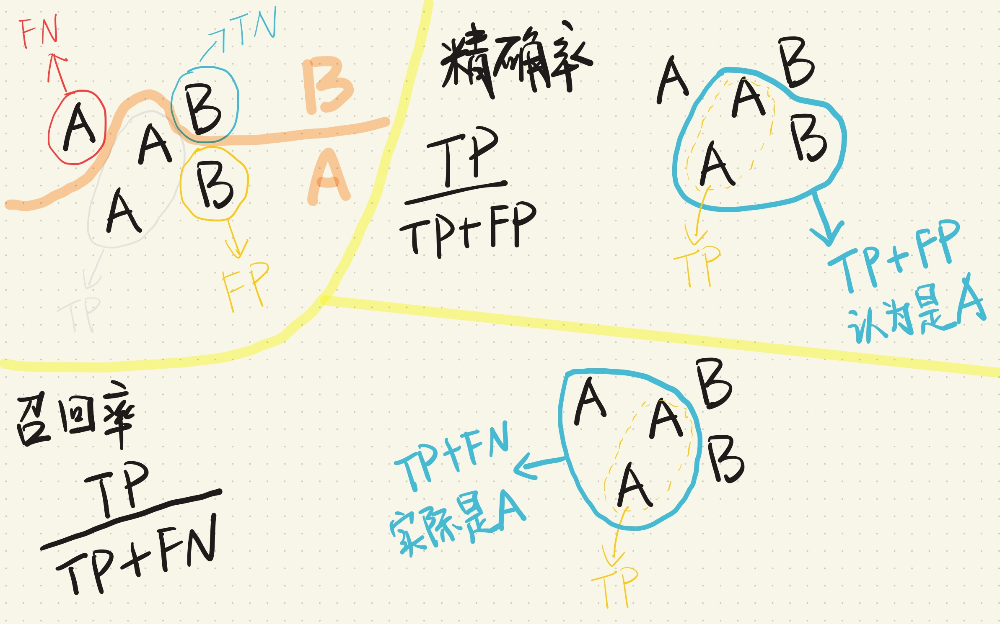
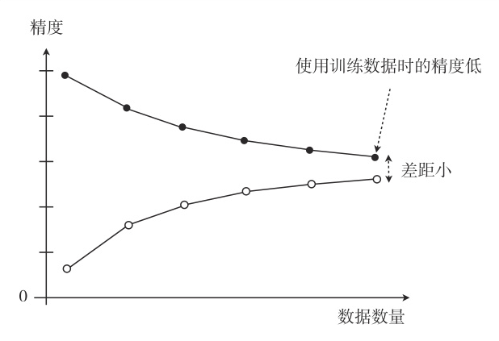
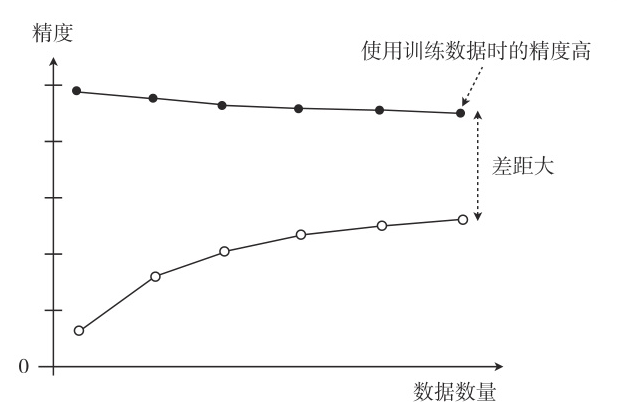

# 交叉验证

怎么评估模型的好坏？把获取的全部训练数据分成两份：一份用于测试，一份用于训练。然后用前者来评估模型。

把全部训练数据分为测试数据和训练数据的做法称为**交叉验证（Cross-validation）**。

交叉验证的方法中，尤为有名的是 **K 折交叉验证（k-fold cross-validation）**：

## 回归

对于回归的情况，只要在训练好的模型上计算测试数据的误差的平方，再取其平均值就可以了，这个值称为**均方误差（MSE, Mean Square Error）**：
$$
MSE = \frac{1}{n}\sum_{i=1}^{n}(y^{(i)} - f_{\bm\theta}(\bm x^{(i)}))^2
$$

## 分类

我们需要考虑到答案是否正确，关于分类的结果，就会有以下的四种情况：

> 混淆矩阵(Confusion Matrix) 是一种在机器学习和统计学中用于评估分类模型性能的工具，它以表格形式展示了模型预测结果与实际类别之间的关系。简单来说，混淆矩阵帮助我们了解模型在各个类别上的预测准确性和错误类型。

精度（Accuracy）是正确预测的比例：
$$
Accuracy = \frac{TP + TN}{TP + FP + FN + TN}
$$
用测试数据来计算这个值，值越高精度越高，也就意味着模型越好。

考虑一个场景，绝大多数数据都是正类（Positive），如果模型总是预测为正类，那么精度会很高，但实际上模型并没有学到任何有用的东西。
因此，精度并不能完全反映模型的好坏。

### 精确率和召回率

先来看精确率（Precision）：
$$
Precision = \frac{TP}{TP + FP}
$$
精确率衡量的是模型**预测为正类**的样本中，**实际为正类**的比例。
> 你说的黑，是不是真的黑？

高精确率意味着模型在预测正类时较少出现误报。

另一个指标是召回率（Recall）：
$$
Recall = \frac{TP}{TP + FN}
$$
召回率衡量的是**实际为正类**的样本中，**模型预测为正类**的比例。
> 这么多的黑，你能找到多少？

高召回率意味着模型能够捕捉到大部分正类样本。

### F-score

通常来说，精确率和召回率是一个平衡的关系。提高精确率可能会降低召回率，反之亦然。
为了综合考虑这两个指标，我们可以使用 F1 值（F1-measure），通常叫 **F1 值**，**调和平均值**：
$$
F1_{measure}
= \frac{2}{\frac{1}{Precision} + \frac{1}{Recall}}
= \frac{2 \cdot Precision \cdot Recall}{Precision + Recall}
$$

还有一个更通用的加权 F 值：
$$
F_{weighted} = \frac{(1 + \beta^2) \cdot Precision \cdot Recall}{\beta^2 \cdot Precision + Recall}
$$

注意到： $F1_{measure} = F_{weighted} \iff \beta = 1$

# 过拟合

模型只能拟合训练数据的状态被称为过拟合（overfitting）。

有几种方法可以避免过拟合：
- 增加全部训练数据的数量
- 使用简单的模型：让模型没法高度拟合训练数据
- 引入对参数的惩罚：正则化

# 正则化

正则化的目标是让模型的参数尽可能小，通常是通过在目标函数中添加一个惩罚项来实现。

## 回归的正则化
对于线性回归，目标函数可以写成：
$$
E(\bm\theta) = \frac{1}{2}\sum_{i=1}^{n}(y^{(i)}-f_{\bm\theta}(\bm x^{(i)}))^2
$$
给它添加一个惩罚项后：
$$
E(\bm\theta) = \frac{1}{2}\sum_{i=1}^{n}(y^{(i)}-f_{\bm\theta}(\bm x^{(i)}))^2 + \frac{\lambda}{2} R(\bm\theta)
\\
R(\bm\theta) = \sum_{j=1}^{m}\theta_j^2
$$
> 1. $\lambda$ 是正则化系数，控制惩罚的强度。
> 2. 因为一般不对偏置项 $\theta_0$ 进行正则化，所以从 $j=1$ 开始。

它可以防止参数变得过大，有助于参数接近较小的值。参数的值变小，意味着该参数的影响也会相应地变小。这是一种通过减小不需要的参数的影响，将复杂模型替换为简单模型来防止过拟合的方式。

## 分类的正则化
对于分类问题，目标函数可以添加正则化项后：
$$
\log L(\bm\theta) = 
-\sum_{i=1}^{n}
\left(
y^{(i)}\log(f_{\bm\theta}(\bm x^{(i)})) + (1-y^{(i)})\log(1-f_{\bm\theta}(\bm x^{(i)}))
\right)
+\frac{\lambda}{2} R(\bm\theta)
\\
R(\bm\theta) = \sum_{j=1}^{m}\theta_j^2
$$

> 目标函数反转符号是为了将最大化问题替换为最小化问题

## 正则化后的微分

我们把目标函数 $E(\bm\theta)$ 拆成原来的目标函数 $C(\bm\theta)$ 和正则化项 $R(\bm\theta)$：
$$
E(\bm\theta) = C(\bm\theta) + R(\bm\theta)
$$
微分后：
$$
\frac{\partial E(\bm\theta)}{\partial \theta_j} = \frac{\partial C(\bm\theta)}{\partial \theta_j} + \frac{\partial R(\bm\theta)}{\partial \theta_j}
$$
其中，正则化项的微分是：
$$
\frac{\partial R(\bm\theta)}{\partial \theta_j} = \lambda\theta_j
$$
因此，正则化后的微分可以写成：
$$
\frac{\partial E(\bm\theta)}{\partial \theta_j} = \frac{\partial C(\bm\theta)}{\partial \theta_j} + \lambda\theta_j
$$

注意到，因为 $\theta_0$ 不参与正则化，所以 $\frac{\partial R(\bm\theta)}{\partial \theta_0} = 0$。
在更新参数的时候要对 $j = 0$ 的情况分情况讨论。

更新参数的公式就不写了，把正则化的部分加到对应的回归、逻辑回归的更新公式中即可。

---

$$
L1 正则化：R(\bm\theta) = \sum_{j=1}^{m}|\theta_j|
\\
L2 正则化：R(\bm\theta) = \sum_{j=1}^{m}\theta_j^2
$$

L1 正则化的特征是被判定为不需要的参数会变为 0，从而减少变
量个数。而 L2 正则化不会把参数变为 0。

# 欠拟合

欠拟合（underfitting）是指模型无法捕捉到数据中的重要模式或趋势，导致模型的预测性能较差。通常发生在模型过于简单，无法适应数据的复杂性时。

只根据精度不能判断是哪种不好的拟合。可以通过绘制学习曲线来判断：

欠拟合的情况是训练集和验证集的精度都很低，且两者相差不大：

过拟合的情况是训练集的精度很高，而验证集的精度很低：

像这样展示了数据数量和精度的图称为学习曲线。