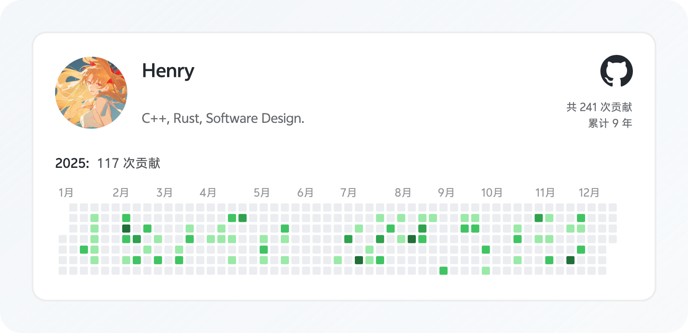

# The 2025 Handbook

在每年十二月的尾声，我们总想试图去用几句话几张图概括过去三百多天，好加入朋友圈热热闹闹的回味军，彰显自己今年过得还不错，颇有公司披露财报之意。

但既然是盘点，总免不了比较，看着看着，一不小心就又容易焦虑起来，“为什么他们假期那么多”“为什么我又没得到……”。

记忆是有权重的，所谓的年度总结，一个不小心就变成 12 月小记、冬季盘点（对了还有人会单独给 12 月发总结吗，没有人给 12 月发声吗？）。幸好我还是有些拍照留档写日记发牢骚的小习惯，总算可以尝试均匀地回味这一年。

而对我来说，生日在这么个节点上，“又过一年”的焕新感似乎总会被“又老一岁”拖累成一个不那么值得期待的事情，更别说当前这份工作的入职时间也是遇着这会，真要总结似有千言万语，又是懒得愚公移山。

循例报名参加攀比项目，如有对比，对象是去年的自己。

# Health is Wealth

身体健康永远会出现在我的任何长文的首段，并作为核心思想呈现。

好像除了十月份打完流感疫苗后，碰巧感冒了两周，以及不定期地进食咬伤导致的口腔溃疡，今年的身体状态未见太多异常。

出门戴口罩，也不爱凑热闹。

换工作后也没健身也没跑步，运动量基本是靠换乘地铁赶班车保障的。本想说搬到新总部了可以把健身房好好利用起来，没想到搬总部的的时间一拖又拖，搬过去之后发现健身房的器材数量也是捉襟见肘。等元旦后隔壁公园开了倒是可以跑跑看看。

# Time Flies

1 月份看了我的最后一场 FNDS，听到了《是但求其爱》《最佳损友》。世界上怎么会有这么完美的艺术品，谢谢你陈奕迅。月底去了肇庆七星湖，这会想想这个年卡大概是回不了本。

2 月份为了方便上班在龙潭租了房子，一大乐事是上下班在楼梯碰见房东的蓝猫。老婆玩胡闹搬家的水平貌似比分手厨房要厉害些。

3 月去了西安，那个让房地产开发商抓耳挠腮的城市。不知道秦始皇去世的时候有没想过带点馍夹肉下去陪葬呢。

4 月开启了好一阵子的寻味顺德活动，晚上频频开着小 P 外出，品鉴各个地方的炸鸡翅炒牛河。澳门也去了，Joey 真是当之无愧的女王级别人物。

5 月带孕妇勇闯大英，回访博物馆和塔桥之余，也在伊斯特本剑桥留下足迹。爱丁堡真冷啊。

进入 6 月之后，绝大多数的周末都用在了产检上。但是没想到吧，周末也能去一趟广西，代价是什么呢？是补胎嘛。

7 月突然流行在家做饭，大家好请叫我的新外号：买买海鲜。（？什么入侵了）

没想到 8 月份又见上了 Eason 一面，愿我们都有面对 fear 的勇气，把握当下。宝宝是女孩，要我说，男孩女孩都一样啦。

9 月的宝贝是黑黑黄黄瘦瘦小小的。有了月嫂每天都会很期待回家看到饭桌上留好的饭菜。

国庆节月嫂是要放假的，爸妈是要硬扛的，宝贝也是这个时候开始跟妈妈出去下午茶吃小蛋糕了。疫情后第一次回到红山动物园，遗憾没见到大山。

11 月多带带适龄婴儿外出。湿趴来到了家门口的音乐节，好久不见。在家楼下看到一台 M2，真好看。

12 月许多个准备下班的傍晚会有很多诡异的问题出现，似乎 BUG 也有着自己的 KPI。宝贝更好动了，似乎没以前那么习惯坐安全提篮。

# Games

今年好像只买了波多黎各，年后就会到货吧。SCOUT 是个不错的聚会小桌游。心灵特工真的适合一玩再玩，基本是个人都喜欢玩。炸弹克星是新版本笨比检测器，但是是最近才买的，有待继续推广挖掘。

真是不敢想，今年玩的二游全 TM 强度膨胀了。方舟的母鸡卡银灰初雪，9 的诺谛卡露西鸭妈，可是我都抽到了，请保持嘴角向下。

# AI and Algo

又是一个 AI 元年。Claude 从 3.5 用到了 4.5，GPT 从 3 用到了 5.1，有个知识全面不知疲倦的朋友陪同，脚踏实地和天马行空都可以随心而动。比较吊诡的是感觉很多时候大家也没在思考，都在被 AI 训练中，不少讨论都沦为了 GPT Arena 罢了。

我是有些怀念那个可以高屋建瓴提点我的人。

在不刷算法推荐流，保持主动获取信息这方面还是保持得不错的。不过偶尔还是刷刷小红书，看看鲨比网友们又在发什么表情包。发现身边很多人已经基本丧失阅读能力了，可怕。

# Being and Connecting

因为工作变动，孩子出生，看乱七八糟的东西，自己的角色和生活模式几乎就没有保持过长期的稳定，在变化中理解自己，rebase 自己，再安顿下来的过程，会感觉到自己的世界的边界会越来越稳定。

在不同的城市跟老同学、老同事见面，是一种很神奇的体验。

# Buy Something

大路灯（9.5 分）：不给 10 分是因为我很期待下一样比它更值得买的东西。

大疆 Osmo Nano（9 分）：孩子注意不到的镜头就是好摄像机。

酷态科 10 号 Mini（9 分）：我还缺一台新的 MacBook 来充分利用这个充电头。

iPad 11（8.5 分）：朴实无华，通勤好友。

神牛 TT350（8 分）：富士机顶闪的垃圾程度让它几度濒临粉身碎骨。

泡机堂 V10（8 分）：GBA 上原来还有这么多好玩的宝可梦改版。

# Learn Something

有记的，看了 86 篇乱七八糟的博客文章。

看书（≥80%）：《克林索尔的最后夏天》《深度学习入门》《编码》《注意力商人》《大教堂与集市》《美国儿科学会育儿百科》《The Matrix Calculus You Need For Deep Learning》《Python 神经网络编程》《白话机器学习的数学》《The Little Book of Linear Algebra》《程序员修炼之道》《蛤蟆先生去看心理医生》《世界作为参考答案》

飞书有 45 篇个人文档。

写了 27 篇博客。

收到了一本赠书，很喜欢。

# To Tomorrow

26 年的 To be done list 好像写差不多了。

明年最大的愿望是买一台落后燃油车。

30 岁，正是听《床头灯》 的年纪。

> 我庆幸我走在一条 不完美的道路
>
> 认清我们 多渺小 多么脆弱
>
> 刺眼的青春宣告沉默 换床头灯一座
>
> 却熨贴了 我蹉跎的 沿路旅程的颠簸
>
> 我庆幸我身在这场 没脚本的演出
>
> 领悟这个姓名 该起的作用
>
> 车窗外 时间无声流动 我也曾任性过
>
> 终于学会了 不再辩驳
